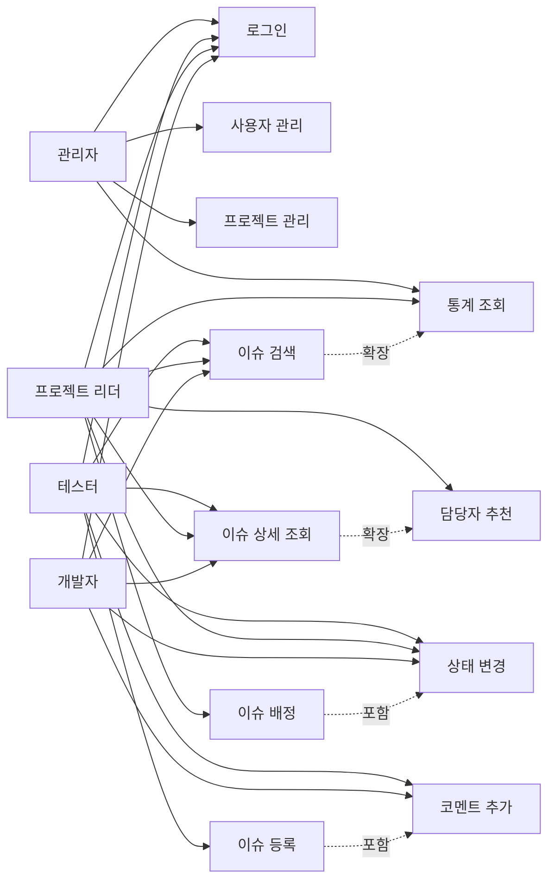
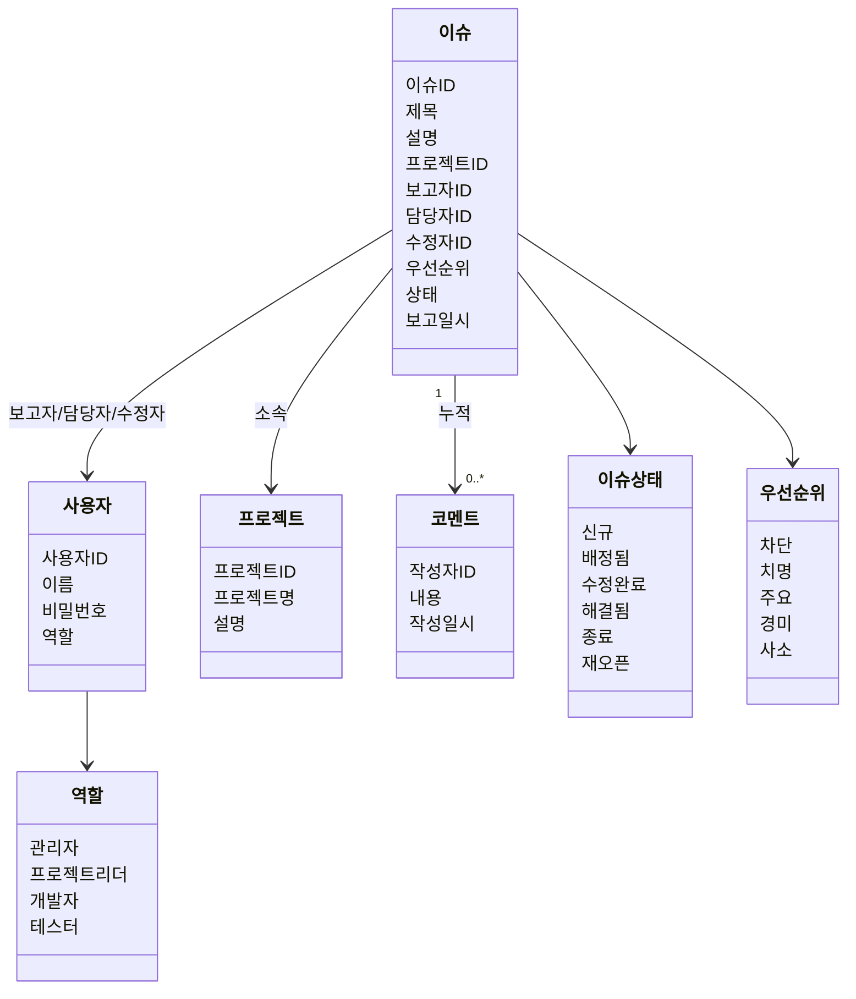
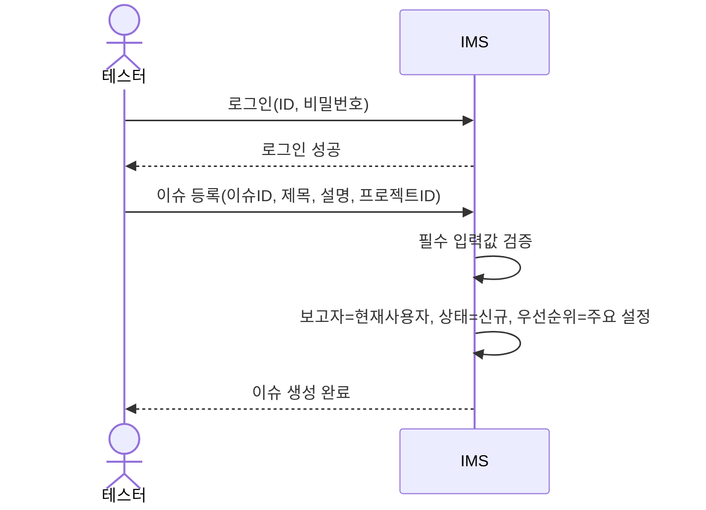
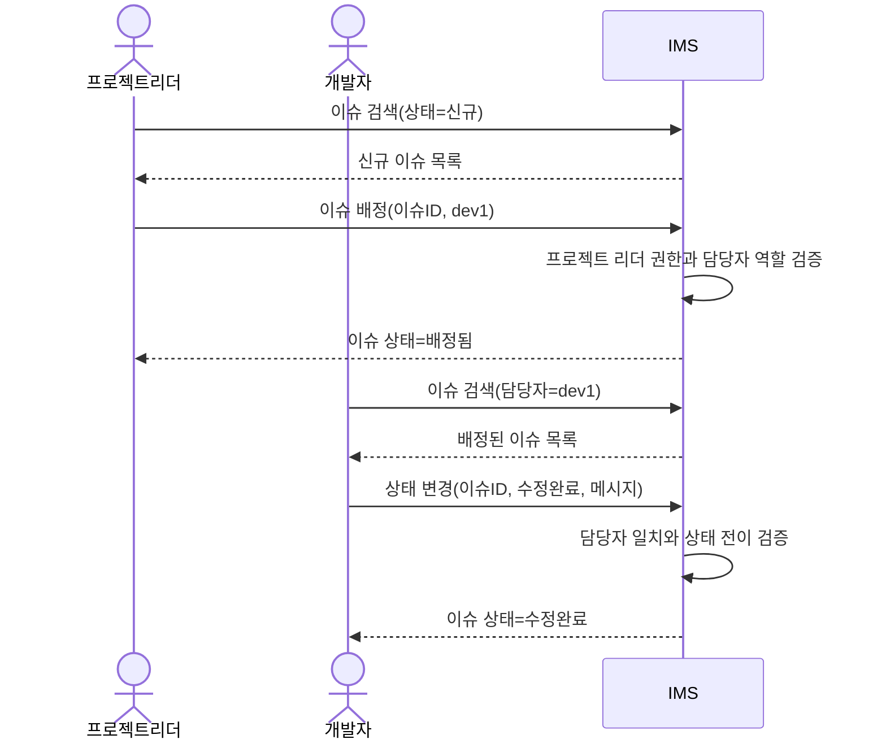
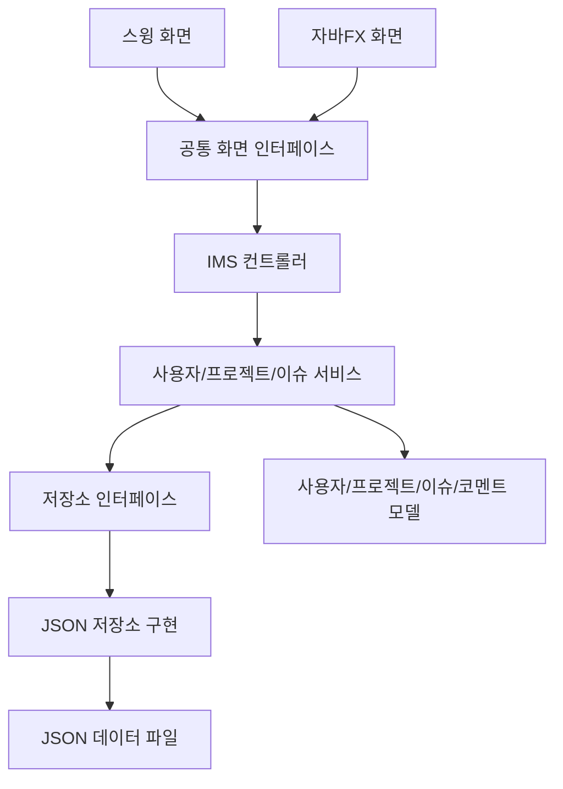
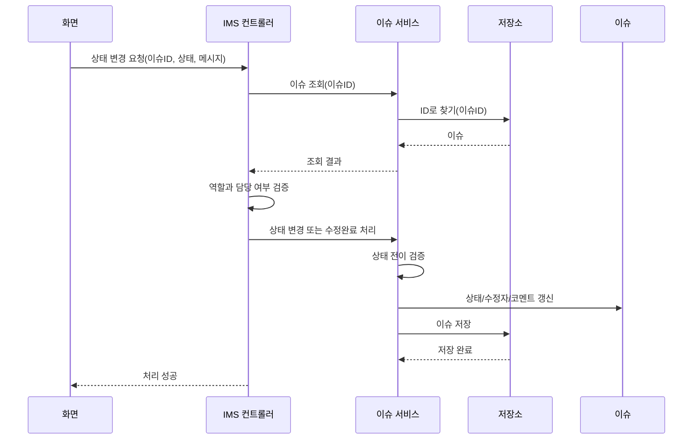
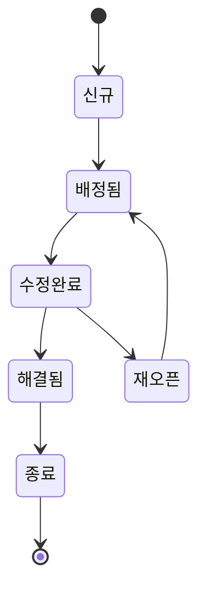

# 이슈 관리 시스템(IMS) 프로젝트 문서

## 표지

- 과목: Software Engineering 2026 Spring
- 프로젝트명: 이슈 관리 시스템(Issue Management System, IMS)
- 팀 번호: TODO
- 팀원: Box5789, DoTaeIn, Jiyuryeong
- GitHub: https://github.com/Box5789/SE_Term_Project_2026-1
- 작성일: 2026-05-13

---

## 1. 프로젝트 내용 요약

본 프로젝트는 소프트웨어 개발 과정에서 발생하는 이슈를 등록, 검색, 배정, 상태 변경, 코멘트 기록, 통계 분석, 담당자 추천까지 수행할 수 있는 Java 기반 이슈 관리 시스템이다. 과제 명세에서 요구한 MVC 아키텍처를 적용하여 UI 계층과 응용 로직/모델/저장소 계층을 분리하였고, JSON 파일 저장소를 통해 프로그램 재시작 후에도 데이터를 재사용할 수 있도록 구현하였다.

프로그램은 두 가지 UI Toolkit을 지원한다.

- Swing UI: 기본 실행 UI이며, 대시보드, 칸반 보드, 이슈 목록/상세, 통계, 관리자 화면을 제공한다.
- JavaFX UI: 두 번째 UI Toolkit 요구사항 충족을 위한 보조 UI이며, 로그인, 이슈 검색, 상세 확인, 코멘트, 상태 변경, 배정, 담당자 추천, 이슈 등록 기능을 제공한다.

주요 실행 명령은 다음과 같다.

```bash
./gradlew run
./gradlew run --args='swing'
./gradlew run --args='javafx'
./gradlew test
./gradlew build
```

현재 구현된 주요 기능은 다음과 같다.

- 계정 관리: Admin, PL, Developer, Tester 역할 지원
- 이슈 등록: title, description 필수 입력, reporter/reported date 자동 설정
- 이슈 검색: project, reporter, assignee, status 기준 검색
- 이슈 상세 조회: 주요 필드와 코멘트 history 확인
- 이슈 상태 변경: `NEW -> ASSIGNED -> FIXED -> RESOLVED -> CLOSED`, `FIXED -> REOPENED -> ASSIGNED`
- 이슈 배정: PL이 Developer에게 이슈 할당
- 코멘트 추가: 작성자와 작성 시간 포함
- 일별/월별 이슈 발생 통계
- resolved/closed 이슈 이력을 활용한 assignee 추천
- JUnit 기반 모델/서비스/컨트롤러 테스트

---

## 2. 요구 정의 및 분석

### 2.1 기능 요구사항

| 요구사항 | 구현 내용 |
| --- | --- |
| 계정 추가 | Admin 계정이 사용자 계정을 생성할 수 있음 |
| 계정 종류 | `ADMIN`, `PL`, `DEV`, `TESTER` enum으로 관리 |
| 이슈 브라우즈 및 검색 | project, reporter, assignee, status 필터 검색 |
| 이슈 등록 | Tester가 title, description, project를 입력하여 등록 |
| 자동 필드 | reporter는 로그인 사용자, reported date는 생성 시각으로 자동 설정 |
| 코멘트 추가 | 이슈 상세 화면에서 코멘트 추가, 작성 시간 누적 |
| 상세 정보 확인 | 이슈 필드와 코멘트 history 표시 |
| 이슈 상태 변경 | 역할과 상태 전이 규칙에 따라 변경 |
| 이슈 통계 분석 | 일별/월별 이슈 발생 횟수 표시 |
| assignee 추천 | resolved/closed 이슈의 제목 유사도 기반 fixer 추천 |
| 다중 UI Toolkit | Swing, JavaFX UI 제공 |
| 영속 저장소 | Jackson 기반 JSON 파일 저장소 |

### 2.2 비기능 요구사항 및 설계 가정

- 구현 언어는 Java로 한다.
- 저장소는 DBMS 대신 JSON 파일 기반 File System을 사용한다.
- UI가 바뀌어도 모델, 서비스, 저장소 계층은 재사용 가능해야 한다.
- Swing과 JavaFX는 동일한 `IMSController`를 사용하므로 응용 로직을 공유한다.
- 비밀번호는 과제 범위상 해시 마이그레이션을 하지 않고 평문 저장을 유지하되, 관리자 UI에서 기존 비밀번호를 그대로 노출하지 않는다.
- 런타임 데이터는 `data/` 디렉터리가 있으면 우선 사용하고, 없으면 리소스 데이터 경로를 사용한다.

### 2.3 액터

| 액터 | 설명 |
| --- | --- |
| 관리자 | 사용자와 프로젝트를 관리하는 관리자 |
| 프로젝트 리더 | 이슈를 개발자에게 배정하고 해결됨 상태의 이슈를 종료 처리 |
| 개발자 | 자신에게 배정된 이슈를 수정하고 수정완료 처리 |
| 테스터 | 이슈를 등록하고 자신이 보고한 수정완료 이슈를 해결됨/재오픈 처리 |

### 2.4 유스케이스 다이어그램



### 2.5 유스케이스 명세

#### UC-01 로그인

- 주 액터: 관리자, 프로젝트 리더, 개발자, 테스터
- 사전 조건: 사용자 계정이 존재한다.
- 기본 흐름:
  1. 사용자가 ID와 비밀번호를 입력한다.
  2. 시스템은 저장된 사용자 정보와 입력값을 비교한다.
  3. 인증 성공 시 현재 사용자로 저장하고 메인 화면을 표시한다.
- 대안 흐름: 인증 실패 시 오류 메시지를 표시한다.
- 사후 조건: 현재 사용자 세션이 설정된다.

#### UC-02 이슈 등록

- 주 액터: 테스터
- 관련 관계: 코멘트 추가를 포함할 수 있다.
- 사전 조건: 테스터가 로그인되어 있고 프로젝트가 존재한다.
- 기본 흐름:
  1. Tester가 이슈 ID, 제목, 설명, 프로젝트 ID를 입력한다.
  2. 시스템은 제목/설명/프로젝트 ID 필수값과 프로젝트 존재 여부를 검증한다.
  3. 시스템은 보고자를 현재 테스터로, 보고 일시를 현재 시각으로 설정한다.
  4. 시스템은 상태를 `NEW`, 우선순위를 `MAJOR`로 설정하고 저장한다.
- 대안 흐름: 필수값이 없거나 중복 ID이면 오류를 표시한다.
- 사후 조건: 신규 이슈가 JSON 저장소에 저장된다.

#### UC-03 이슈 검색 및 상세 조회

- 주 액터: 관리자, 프로젝트 리더, 개발자, 테스터
- 관련 관계: 상세 조회는 담당자 추천으로 확장될 수 있다.
- 기본 흐름:
  1. 사용자가 프로젝트/보고자/담당자/상태 필터를 입력한다.
  2. 시스템은 조건에 맞는 이슈 목록을 조회한다.
  3. 사용자가 이슈를 선택한다.
  4. 시스템은 제목, 설명, 보고자, 담당자, 수정자, 우선순위, 상태, 코멘트를 표시한다.
- 사후 조건: 선택한 이슈의 상세 정보가 화면에 표시된다.

#### UC-04 이슈 배정

- 주 액터: PL
- 관련 관계: 상태 변경을 포함한다.
- 사전 조건: PL이 로그인되어 있고 이슈 상태가 `NEW` 또는 `REOPENED`이다.
- 기본 흐름:
  1. 프로젝트 리더가 이슈와 개발자 ID를 선택한다.
  2. 시스템은 담당자가 개발자 역할인지 확인한다.
  3. 시스템은 담당자를 저장하고 상태를 `ASSIGNED`로 변경한다.
  4. 시스템은 배정 코멘트를 추가한다.
- 대안 흐름: 개발자가 아닌 사용자에게 배정하려 하면 오류를 표시한다.
- 사후 조건: 이슈가 특정 개발자에게 할당된다.

#### UC-05 이슈 수정 완료 및 검증

- 주 액터: 개발자, 테스터
- 기본 흐름:
  1. 개발자가 자신에게 할당된 `ASSIGNED` 이슈를 확인한다.
  2. 개발자가 수정 메시지를 입력하고 상태를 `FIXED`로 변경한다.
  3. 시스템은 수정자를 해당 개발자로 저장한다.
  4. 보고자인 테스터가 수정완료 이슈를 확인한다.
  5. 테스터가 수정 결과를 검증하고 `RESOLVED` 또는 `REOPENED`로 변경한다.
- 대안 흐름: 담당자가 아닌 개발자가 수정완료 처리하면 오류를 표시한다.
- 사후 조건: 이슈가 검증 완료 또는 재오픈 상태가 된다.

#### UC-06 이슈 종료 및 담당자 추천

- 주 액터: PL
- 관련 관계: 상세 조회에서 담당자 추천 기능이 확장된다.
- 기본 흐름:
  1. 프로젝트 리더가 `RESOLVED` 상태 이슈를 검색한다.
  2. 프로젝트 리더가 검증된 이슈를 선택하고 `CLOSED`로 변경한다.
  3. 프로젝트 리더가 신규 이슈 상세를 조회하면 시스템은 해결됨/종료 이슈 이력을 분석한다.
  4. 시스템은 유사 제목을 가진 기존 이슈의 수정자를 추천 후보로 표시한다.
- 사후 조건: 이슈는 종료 상태가 되며, 추천 기능은 다음 배정에 활용될 수 있다.

---

## 3. 도메인 모델



핵심 도메인 객체는 사용자, 프로젝트, 이슈, 코멘트이다. 이슈는 프로젝트에 속하며 reporter, assignee, fixer를 사용자 ID로 참조한다. 코멘트는 이슈 내부에 누적 저장되며 작성자와 작성 시각을 함께 가진다.

---

## 4. SSD 및 Operation Contract

### 4.1 SSD: 이슈 등록



### 4.2 SSD: 이슈 배정 및 수정 완료



### 4.3 Operation Contract: createIssue

- 오퍼레이션: `createIssue(id, title, description, projectId)`
- 관련 유스케이스: UC-02
- 사전 조건:
  - 현재 사용자가 로그인되어 있다.
  - 현재 사용자의 역할은 Tester이다.
  - 이슈 ID가 중복되지 않는다.
  - 프로젝트 ID가 존재한다.
  - title, description, projectId가 비어 있지 않다.
- 사후 조건:
  - 새 `Issue` 객체가 생성된다.
  - `reporterId`는 현재 사용자 ID로 설정된다.
  - `reportedDate`는 현재 시각으로 설정된다.
  - `status`는 `NEW`로 설정된다.
  - `priority`는 `MAJOR`로 설정된다.
  - JSON 저장소에 이슈가 저장된다.

### 4.4 Operation Contract: assignIssue

- 오퍼레이션: `assignIssue(issueId, assigneeId)`
- 관련 유스케이스: UC-04
- 사전 조건:
  - 현재 사용자가 로그인되어 있다.
  - 현재 사용자의 역할은 PL이다.
  - 대상 이슈가 존재한다.
  - 대상 이슈 상태가 `NEW` 또는 `REOPENED`이다.
  - assignee가 존재하고 역할이 Developer이다.
- 사후 조건:
  - 이슈의 `assigneeId`가 지정된 Developer ID로 설정된다.
  - 이슈 상태가 `ASSIGNED`로 변경된다.
  - 배정 코멘트가 이슈 comment history에 추가된다.
  - JSON 저장소가 갱신된다.

---

## 5. 설계

### 5.1 아키텍처 개요



프로젝트는 MVC 패턴을 중심으로 구성된다. View 계층은 Swing과 JavaFX 두 구현으로 나뉘지만, 두 UI 모두 동일한 `IMSController`를 호출한다. Controller는 로그인 사용자와 권한 정책을 관리하고, Service는 도메인 규칙과 저장소 갱신을 담당한다. Repository 인터페이스와 JsonRepository 구현을 분리하여 저장 방식 변경 가능성을 확보하였다.

### 5.2 주요 클래스

| 계층 | 클래스 | 책임 |
| --- | --- | --- |
| Model | `User`, `Project`, `Issue`, `Comment` | 도메인 데이터 표현 |
| Model | `Role`, `IssueStatus`, `Priority` | 역할, 상태, 우선순위 값 정의 |
| Repository | `Repository<T>` | 저장소 공통 인터페이스 |
| Repository | `JsonRepository<T>` | JSON 파일 기반 저장/조회/수정/삭제 |
| Service | `UserService` | 사용자 생성, 로그인, 수정, 삭제 |
| Service | `ProjectService` | 프로젝트 생성, 조회, 수정, 삭제 |
| Service | `IssueService` | 이슈 생성, 검색, 코멘트, 상태 전이, 추천 |
| Controller | `IMSController` | UI 요청 처리, 현재 사용자, 권한 검증 |
| View | `SwingView` | 기본 GUI |
| View | `JavaFxView` | JavaFX 보조 GUI |

### 5.3 시퀀스 다이어그램: 상태 변경



### 5.4 GRASP 및 설계 원칙 적용

- Controller: `IMSController`가 UI 이벤트를 응용 로직 호출로 변환한다. UI는 서비스 세부 구현을 직접 알지 않는다.
- Information Expert: 이슈 상태 전이와 추천 로직은 이슈 데이터를 가장 잘 아는 `IssueService`가 담당한다.
- Low Coupling: View는 `IMSController`에만 의존하고, Service는 `Repository` 인터페이스에 의존한다.
- High Cohesion: 사용자, 프로젝트, 이슈 관련 책임을 각각 `UserService`, `ProjectService`, `IssueService`로 분리하였다.
- Protected Variations: JSON 저장소 구현을 `Repository` 인터페이스 뒤로 숨겨 향후 DBMS로 변경할 때 Service 영향도를 줄였다.
- MVC: Swing/JavaFX UI는 모델과 직접 결합하지 않고 Controller를 통해 기능을 사용한다.

---

## 6. 구현 결과

### 6.1 실행 및 초기 데이터

애플리케이션 시작 시 JSON 저장소를 로드하고, 저장소가 비어 있으면 데모 계정을 생성한다.

- Admin: `admin / admin123`
- PL: `pl1 / pl123`, `pl2 / pl123`
- Developer: `dev1 ~ dev10 / dev123`
- Tester: `tester1 ~ tester5 / test123`
- 기본 프로젝트: `project1`

### 6.2 Swing UI

Swing UI는 기본 실행 화면이며 다음 기능을 제공한다.

- 로그인
- 대시보드
- 칸반 보드
- 이슈 목록 및 필터 검색
- 이슈 상세와 코멘트 history
- 코멘트 추가
- 이슈 상태 변경 및 배정
- 일별/월별 통계
- Admin용 사용자/프로젝트 관리

스크린샷 삽입 위치:

- TODO: Swing 로그인 화면
- TODO: Swing 이슈 목록/상세 화면
- TODO: Swing 통계 화면
- TODO: Swing 관리자 화면

### 6.3 JavaFX UI

JavaFX UI는 두 번째 UI Toolkit 요구사항을 충족하기 위한 보조 GUI이다. 다음 기능을 제공한다.

- 로그인
- 이슈 목록 조회
- project/reporter/assignee/status 검색
- 상세 정보 및 코멘트 조회
- 코멘트 추가
- PL의 이슈 배정
- 상태 변경
- Tester의 이슈 등록
- PL의 추천 담당자 표시

스크린샷 삽입 위치:

- TODO: JavaFX 로그인 화면
- TODO: JavaFX 이슈 검색/상세 화면

### 6.4 이슈 상태 전이

시스템은 다음 상태 전이를 허용한다.



역할별 권한은 다음과 같이 제한된다.

| 역할 | 허용 기능 |
| --- | --- |
| 관리자 | 사용자/프로젝트 관리, 이슈 수정/삭제 |
| 프로젝트 리더 | 이슈 배정, 종료 처리, 추천 확인 |
| 개발자 | 자신에게 배정된 이슈 수정완료 처리 |
| 테스터 | 이슈 등록, 본인이 보고한 수정완료 이슈 해결됨/재오픈 처리 |

### 6.5 Assignee 추천 방식

추천 기능은 resolved/closed 상태의 기존 이슈를 대상으로 한다. 신규 이슈 title과 기존 해결 이슈 title을 단어 단위로 비교하여 공통 키워드 수를 계산하고, 점수가 높은 fixer를 최대 3명까지 추천한다.

이 방식은 복잡한 학습 모델을 사용하지 않지만, 과제 명세에서 허용한 Information Retrieval 기반 유사 이슈 추천 방식에 해당한다. 또한 별도 학습 단계가 필요 없으므로 데모 시점의 데이터가 즉시 추천 결과에 반영된다.

---

## 7. 테스트 수행 내역

### 7.1 테스트 환경

- 테스트 프레임워크: JUnit 5
- 빌드 도구: Gradle
- 테스트 명령:

```bash
./gradlew test
./gradlew build
```

### 7.2 주요 테스트 케이스

| 테스트 | 목적 |
| --- | --- |
| `ScenarioTest.testScenario` | 과제 PDF 예제 시나리오 전체 흐름 검증 |
| `testControllerRoleRulesAndPdfScenario` | 역할별 권한과 시나리오 기반 상태 변경 검증 |
| `testValidationStatisticsAndPersistence` | 필수 입력 검증, 잘못된 상태 전이 차단, 일/월별 통계, JSON readback 검증 |
| `testAdminOnlyManagementAndPasswordPreserve` | Admin 전용 기능과 비밀번호 미변경 규칙 검증 |
| `I18nTest` | 영어/한국어 메시지 리소스와 missing key 처리 검증 |

### 7.3 테스트 시나리오 요약

1. Admin이 기본 계정과 프로젝트를 준비한다.
2. Tester가 이슈를 생성하고 코멘트를 추가한다.
3. PL이 new 이슈를 검색하고 dev1에게 배정한다.
4. dev1이 자신에게 assign된 이슈를 fixed 처리한다.
5. Reporter인 tester1이 fixed 이슈를 resolved 처리한다.
6. PL이 resolved 이슈를 closed 처리한다.
7. resolved/closed 이력을 기반으로 새로운 유사 이슈에 대해 dev1이 추천되는지 확인한다.

### 7.4 테스트 결과

최신 구현 후 다음 명령이 성공하였다.

```text
./gradlew test  -> BUILD SUCCESSFUL
./gradlew build -> BUILD SUCCESSFUL
```

---

## 8. GitHub 프로젝트 활용 요약

GitHub 저장소는 다음 주소를 사용하였다.

- https://github.com/Box5789/SE_Term_Project_2026-1

최근 commit history 예시는 다음과 같다.

```text
e88d34a Initialize internationalization (i18n) support with English and Korean resources, and add localization utility with tests
d9518c0 Add sample issues.json for initial data population
cd89fff Initialize Issue Management System (IMS) project with core implementation and build setup
6cf89d5 add gitignore .idea
9d17655 add gitignore .idea
5fb1357 gitignore
760ba63 Initial commit
```

프로젝트 진행 내역 스크린샷 삽입 위치:

- TODO: GitHub repository main page
- TODO: commit history
- TODO: issue/project board 또는 팀별 작업 내역

팀원별 역할은 프론트엔드, 백엔드, 프로젝트 관리/아키텍처 관점에서 다음과 같이 분담하였다.

| 팀원 | 역할 | 주요 담당 |
| --- | --- | --- |
| Box5789 | 프로젝트 리더 및 시스템 아키텍트 | 전체 설계 방향, MVC 구조, 빌드/실행 환경, GitHub 관리, 최종 통합 |
| DoTaeIn | 백엔드 개발자 | 도메인 모델, 서비스 로직, JSON 저장소, 권한/상태 전이 규칙, JUnit 테스트 |
| Jiyuryeong | 프론트엔드 및 문서 담당 | Swing/JavaFX UI, 사용자 화면 흐름, 다국어 리소스, 보고서 및 발표 자료 |

---

## 9. 결론

본 프로젝트는 Java 기반 이슈 관리 시스템으로서 과제 명세의 핵심 요구사항인 MVC 설계, 영속 저장소, GUI 기반 동작, 두 개 이상의 UI Toolkit, JUnit 테스트, 이슈 등록/검색/배정/상태 변경/통계/추천 기능을 구현하였다. 특히 Swing과 JavaFX가 동일한 Controller와 Service를 공유하도록 설계하여 UI 교체 가능성과 모델 재사용성을 확보하였다.

향후 개선 가능 사항은 다음과 같다.

- 비밀번호 해시 저장으로 보안 강화
- 추천 알고리즘을 TF-IDF 또는 머신러닝 기반으로 개선
- 프로젝트별 멤버 관리 기능 추가
- 통계 차트 시각화 고도화
- GitHub Actions를 이용한 자동 테스트 환경 구축
